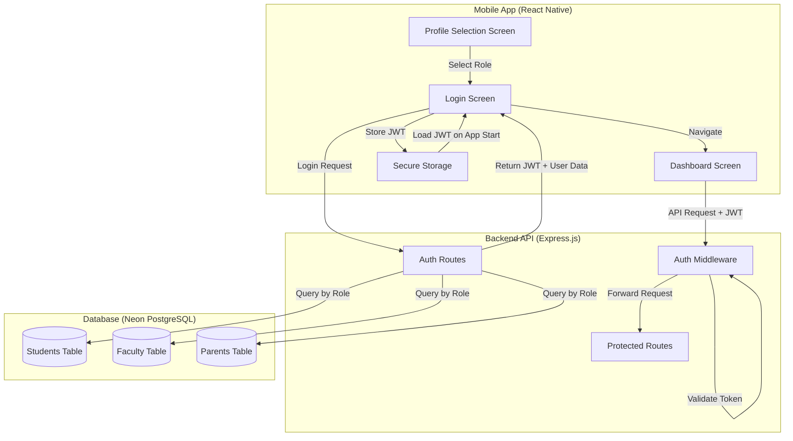

# Design Document

## Overview

This design document outlines the architecture and implementation approach for enhancing the role-based authentication system. The system will transition from plain-text password storage to secure bcrypt hashing, implement JWT-based stateless authentication, add session persistence in the mobile app, and create authentication middleware for protecting API endpoints.

The design maintains the existing three-table structure (students, faculty, parents) while adding security layers and improving the authentication flow. The solution uses industry-standard libraries (bcrypt, jsonwebtoken) and follows REST API best practices.

## Architecture

### High-Level Architecture



### Authentication Flow

1. **Registration Flow**: User submits role-specific data → Backend validates → Password hashed with bcrypt → User record created → Success response (no JWT yet)
2. **Login Flow**: User submits credentials + role → Backend queries role table → Password verified with bcrypt → JWT generated → Token + user data returned → Mobile app stores token
3. **Session Persistence**: App launches → Check secure storage for JWT → Validate token expiration → Auto-login if valid or redirect to login
4. **Protected API Access**: Request sent with JWT in Authorization header → Middleware validates token → Extract user info → Forward to route handler

## Components and Interfaces

### Backend Components

#### 1. Password Hashing Service

**Purpose**: Centralize password hashing and verification logic

**Functions**:
- `hashPassword(plainPassword)`: Accepts plain text password, returns bcrypt hash with salt rounds = 10
- `verifyPassword(plainPassword, hashedPassword)`: Compares plain password with hash, returns boolean

**Dependencies**: bcrypt library

#### 2. JWT Service

**Purpose**: Handle JWT token generation and verification

**Functions**:
- `generateToken(payload)`: Creates JWT with user ID, role, and 7-day expiration
- `verifyToken(token)`: Validates JWT signature and expiration, returns decoded payload or throws error

**Configuration**:
- Secret key: Stored in environment variable `JWT_SECRET`
- Token expiration: 7 days (configurable)
- Algorithm: HS256

#### 3. Authentication Middleware

**Purpose**: Protect routes requiring authentication

**Behavior**:
- Extract token from `Authorization: Bearer <token>` header
- Verify token using JWT service
- Attach decoded user data to `req.user`
- Call `next()` if valid, return 401 if invalid/missing

**Interface**:
```javascript
function authMiddleware(req, res, next)
```

#### 4. Enhanced Auth Routes

**Endpoints**:

**POST /api/auth/register/student**
- Request: `{ student_id, name, email, password, phone?, department?, semester?, enrollment_year?, date_of_birth?, address? }`
- Response: `{ success, message, user }` (201) or error (400/409/500)
- Behavior: Hash password, insert into students table

**POST /api/auth/register/faculty**
- Request: `{ faculty_id, name, email, password, phone?, department?, designation?, joining_date?, specialization?, address? }`
- Response: `{ success, message, user }` (201) or error (400/409/500)
- Behavior: Hash password, insert into faculty table

**POST /api/auth/register/parent**
- Request: `{ parent_id, name, email, password, phone?, student_id?, relationship?, occupation?, address? }`
- Response: `{ success, message, user }` (201) or error (400/409/500)
- Behavior: Hash password, validate student_id if provided, insert into parents table

**POST /api/auth/login**
- Request: `{ userId, password, role }`
- Response: `{ success, message, token, user, role }` (200) or error (400/401/500)
- Behavior: Query role table, verify password with bcrypt, generate JWT, return token + user data

**GET /api/auth/verify**
- Request: JWT in Authorization header
- Response: `{ success, user, role }` (200) or error (401)
- Behavior: Validate token, return user info (for session restoration)

**POST /api/auth/logout**
- Request: JWT in Authorization header (optional)
- Response: `{ success, message }` (200)
- Behavior: Server-side logout placeholder (client handles token removal)

### Mobile App Components

#### 1. Secure Storage Service

**Purpose**: Persist JWT tokens securely across app sessions

**Functions**:
- `storeToken(token)`: Save JWT to secure storage (AsyncStorage with encryption or Expo SecureStore)
- `getToken()`: Retrieve stored JWT
- `removeToken()`: Delete stored JWT on logout
- `storeUserData(user, role)`: Save user profile data
- `getUserData()`: Retrieve stored user data
- `clearAll()`: Remove all stored authentication data

**Storage Keys**:
- `auth_token`: JWT token
- `user_data`: Serialized user object
- `user_role`: User role string

#### 2. Enhanced UserContext

**Purpose**: Manage global authentication state

**State**:
- `isAuthenticated`: Boolean indicating login status
- `userRole`: Current user role (student/faculty/parent)
- `userData`: User profile information
- `token`: JWT token
- `loading`: Boolean for async operations

**Functions**:
- `login(role, user, token)`: Update state and store token
- `logout()`: Clear state and remove stored token
- `restoreSession()`: Load token from storage and verify with backend
- `setUserRole(role)`: Update selected role

#### 3. Enhanced Login Screen

**Additions**:
- Loading state management during API calls
- Error handling with user-friendly messages
- Token storage on successful login
- Network error detection

#### 4. App Initialization Logic

**Purpose**: Check for existing session on app launch

**Behavior**:
- Display splash screen
- Check secure storage for JWT token
- If token exists, call `/api/auth/verify` endpoint
- If valid, restore session and navigate to Dashboard
- If invalid/missing, navigate to Profile Selection
- Handle loading and error states

## Data Models

### Database Schema (No Changes)

The existing database schema remains unchanged:

**students table**: id, student_id (unique), name, email (unique), password, phone, department, semester, enrollment_year, date_of_birth, address, created_at, updated_at

**faculty table**: id, faculty_id (unique), name, email (unique), password, phone, department, designation, joining_date, specialization, address, created_at, updated_at

**parents table**: id, parent_id (unique), name, email (unique), password, phone, student_id (FK), relationship, occupation, address, created_at, updated_at

**Note**: The `password` field will now store bcrypt hashes instead of plain text.

### JWT Payload Structure

```javascript
{
  userId: string,        // student_id, faculty_id, or parent_id
  role: string,          // 'student', 'faculty', or 'parent'
  email: string,         // User email
  iat: number,           // Issued at timestamp
  exp: number            // Expiration timestamp (7 days from iat)
}
```

### API Response Models

**Success Response**:
```javascript
{
  success: true,
  message: string,
  token?: string,        // Only for login
  user: {
    // Role-specific fields without password
  },
  role?: string          // Only for login
}
```

**Error Response**:
```javascript
{
  success: false,
  message: string,
  error?: string         // Detailed error in development mode
}
```

## Error Handling

### Backend Error Handling Strategy

**1. Validation Errors (400)**
- Missing required fields
- Invalid data formats
- Invalid role selection
- Response: `{ success: false, message: "Specific validation error" }`

**2. Authentication Errors (401)**
- Invalid credentials
- Missing JWT token
- Expired JWT token
- Invalid JWT signature
- Response: `{ success: false, message: "Authentication failed" }`

**3. Conflict Errors (409)**
- Duplicate user ID
- Duplicate email
- Response: `{ success: false, message: "User ID or email already exists" }`

**4. Server Errors (500)**
- Database connection failures
- Bcrypt hashing errors
- JWT generation errors
- Response: `{ success: false, message: "Internal Server Error" }`
- Behavior: Log full error details, return generic message to client

**Error Logging**:
- Use console.error for development
- Log timestamp, error type, request path, user ID (if available)
- Never log passwords or full JWT tokens
- Consider structured logging library (winston/pino) for production

### Mobile App Error Handling

**1. Network Errors**
- Detect fetch failures
- Display: "Unable to connect to server. Please check your connection."
- Allow retry

**2. Authentication Errors**
- Display server error message in Alert
- Clear invalid tokens from storage
- Redirect to login screen

**3. Validation Errors**
- Display inline validation messages
- Prevent form submission until valid

**4. Token Expiration**
- Detect 401 responses during API calls
- Clear stored token
- Redirect to login with message: "Session expired. Please login again."

## Testing Strategy

### Backend Testing

**Unit Tests**:
- Password hashing service: Test hash generation and verification
- JWT service: Test token generation, verification, and expiration
- Auth middleware: Test token validation logic with valid/invalid/missing tokens

**Integration Tests**:
- Registration endpoints: Test successful registration, duplicate handling, validation errors
- Login endpoint: Test successful login, invalid credentials, missing fields
- Protected routes: Test access with valid token, invalid token, missing token
- Parent-student linking: Test foreign key validation

**Test Data**:
- Create test users for each role
- Use test database or transaction rollback
- Mock bcrypt for faster tests (optional)

**Tools**: Jest or Mocha with Supertest for API testing

### Mobile App Testing

**Unit Tests**:
- Secure storage service: Test token storage and retrieval
- UserContext: Test state management functions

**Integration Tests**:
- Login flow: Test successful login, error handling, token storage
- Session restoration: Test app launch with valid/invalid/missing token
- Logout flow: Test token removal and navigation

**Manual Testing Checklist**:
- [ ] Register new users for each role
- [ ] Login with valid credentials for each role
- [ ] Login with invalid credentials
- [ ] Close and reopen app (session persistence)
- [ ] Logout and verify token removal
- [ ] Test with network disconnected
- [ ] Test token expiration (modify expiration time for testing)

**Tools**: Jest with React Native Testing Library

### Security Testing

- [ ] Verify passwords are hashed in database
- [ ] Verify JWT tokens expire correctly
- [ ] Test SQL injection attempts on login/registration
- [ ] Verify password is never returned in API responses
- [ ] Test authorization bypass attempts on protected routes
- [ ] Verify secure storage encryption on mobile device

## Implementation Notes

### Dependencies to Add

**Backend**:
```json
{
  "bcrypt": "^5.1.1",
  "jsonwebtoken": "^9.0.2"
}
```

**Mobile**:
```json
{
  "expo-secure-store": "^13.0.1"  // or @react-native-async-storage/async-storage
}
```

### Environment Variables

Add to `backend/.env`:
```
JWT_SECRET=<generate-random-secret-key>
JWT_EXPIRATION=7d
```

### Migration Strategy

**For Existing Users with Plain Text Passwords**:

Option 1 (Recommended): Force password reset
- Add `password_reset_required` boolean field to all tables
- Set to `true` for existing users
- On login, check flag and require password change
- Hash new password and set flag to `false`

Option 2: One-time migration script
- Create script to hash all existing passwords
- Run once before deploying new code
- Requires maintenance window

**For New Implementation**: All new registrations will automatically use hashed passwords.

### Performance Considerations

- Bcrypt hashing is CPU-intensive: Use appropriate salt rounds (10 is standard)
- JWT verification is fast: No database lookup needed for authentication
- Consider rate limiting on login endpoint to prevent brute force attacks
- Database indexes already exist on unique fields (student_id, faculty_id, parent_id, email)

### Security Best Practices

1. Use HTTPS in production for all API calls
2. Set secure HTTP-only cookies for web version (if applicable)
3. Implement refresh token mechanism for long-lived sessions (future enhancement)
4. Add rate limiting middleware to prevent brute force attacks
5. Validate and sanitize all user inputs
6. Use parameterized queries (already using postgres template literals)
7. Implement CORS properly (already configured)
8. Add request logging for security auditing
